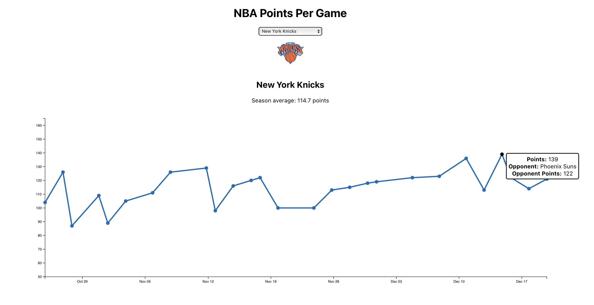

# NBA Points Per Game Visualization
This is a full-stack application to query Basketball Reference and visualize how many points a team has scored




```
# Run in docker
docker compose up --build

# Run microservices separately
cd backend && flask run

# In a separate terminal window...
cd frontend && npm run start
```

## Flask Backend
* This is a very simple API to scrape data from Basketball Reference, clean it, and return it in a JSON object

## React Frontend
* This application receives data from the API and visualizes it in a D3 line chart
